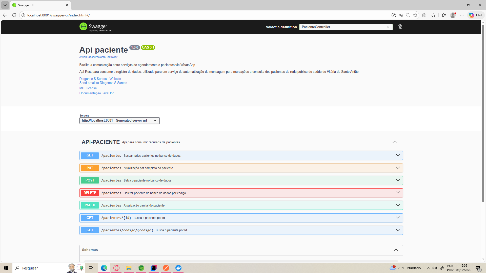
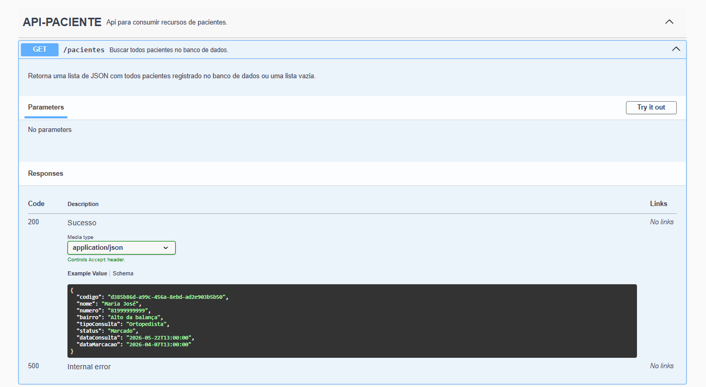
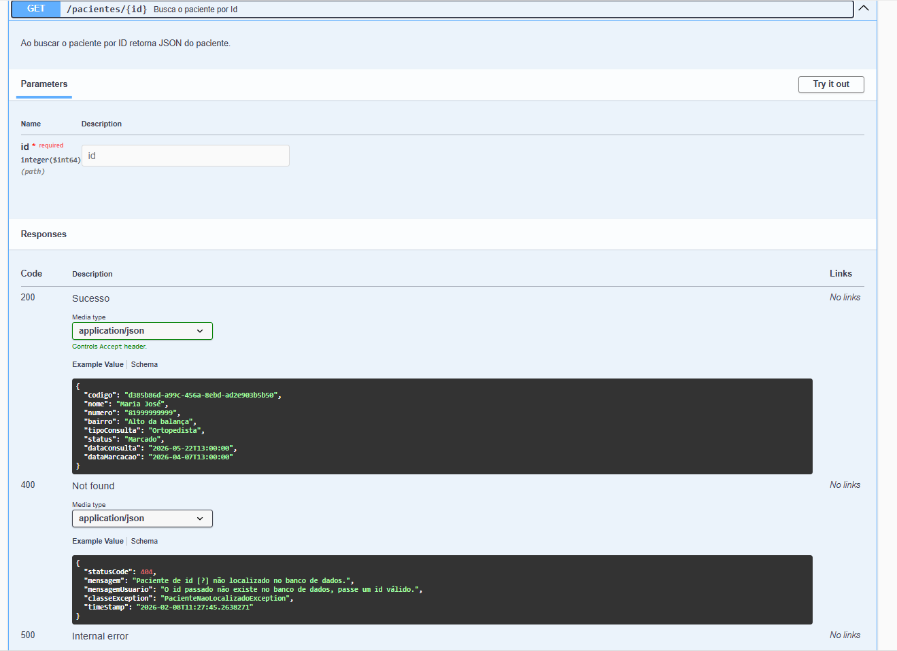
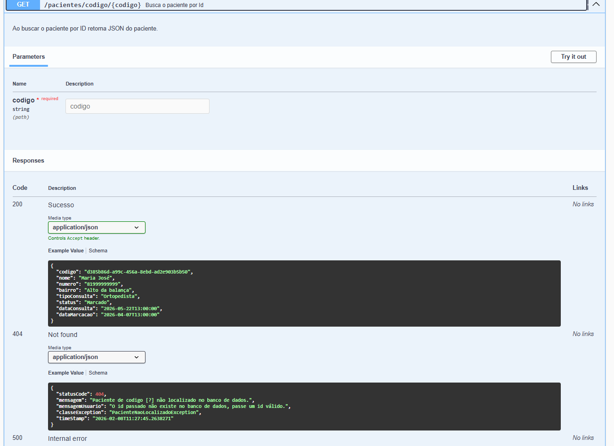
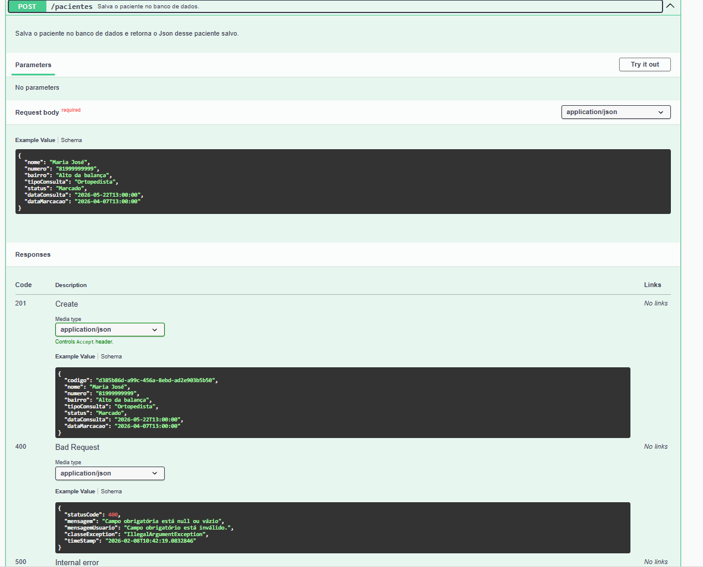
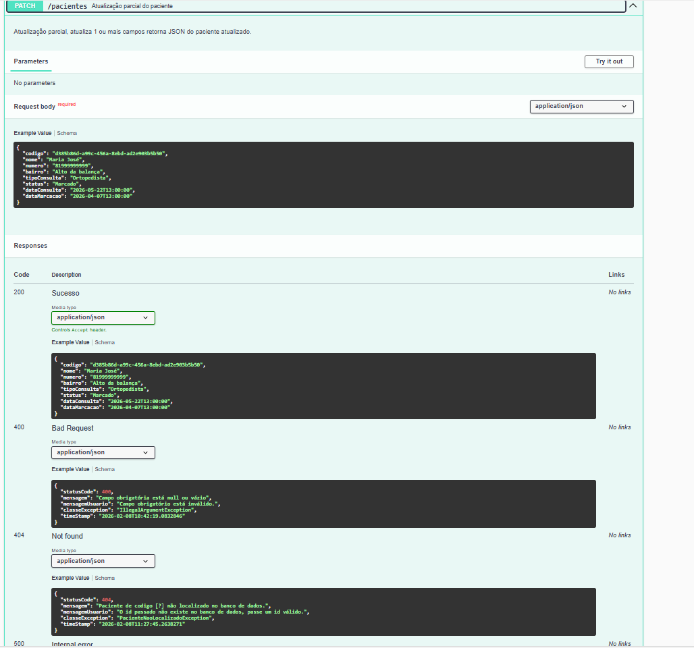
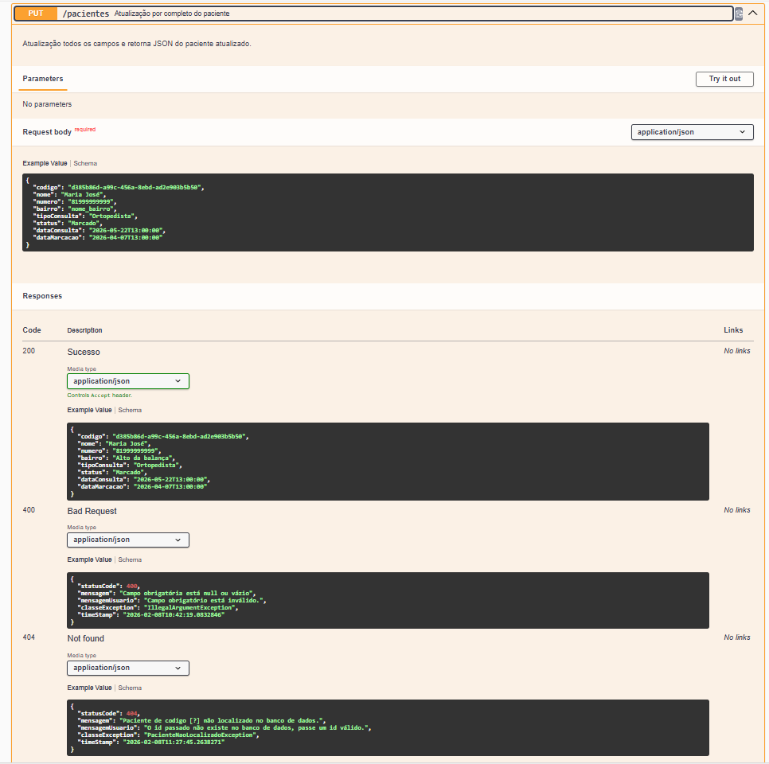
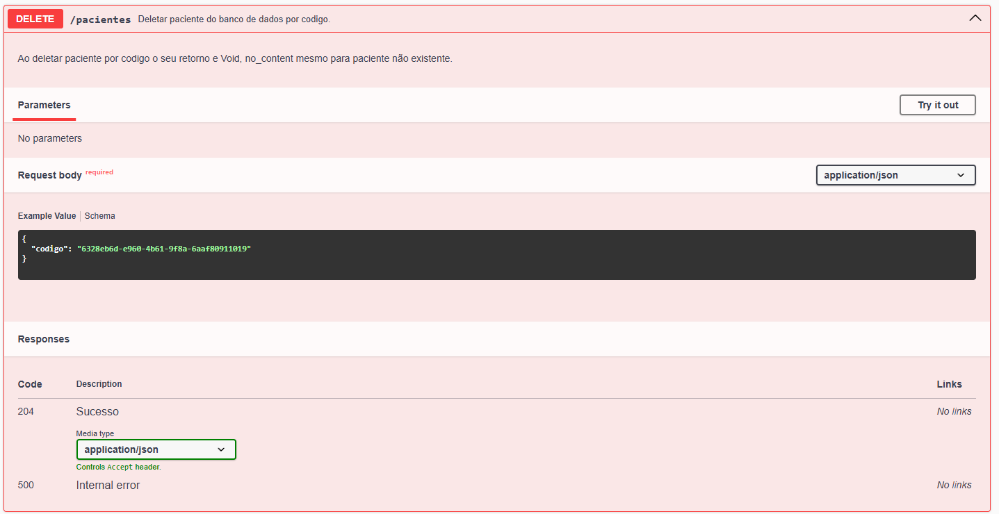
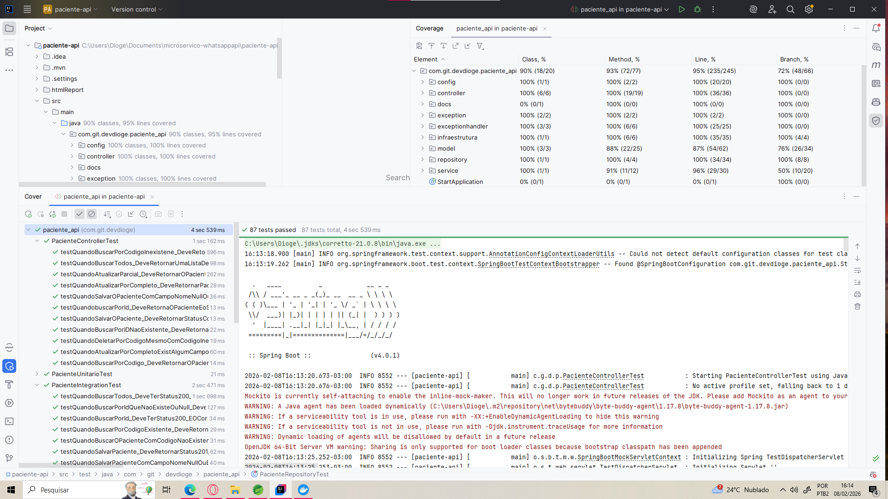

# API-PACIENTE
A api foi desenvolvida para um projeto aonde existe automação de marcações e consulta de exames da secretária de saúde do município.
## pacientes

É o recurso que permite você criar, obter, atualizar(parcial ou por completo) e deletar os pacientes.  

> **⚠️ Atenção**
>
> Essa api foi desenvolvida inicialmente como [monolitico](https://github.com/DiogenesSSantos/whatsapp-api), e hoje está a ser convertida em microserviço. 


### URL base para as chamadas 
```
http://localhost:8080/paciente-api/pacientes
```

### Endpoints

| Método | Nome do endpoint                | Descrição                                                                                          |
|--------|---------------------------------|----------------------------------------------------------------------------------------------------|
| POST   | Criar paciente                  | Cria um novo paciente.                                                                             |
| GET    | Buscar todos pacientes          | buscar todos pacientes registrados.                                                                | 
| GET    | Obter pacientes por id          | Consulte todas as informações de um paciente através de um``id`` .                                 | 
| GET    | Obter pacientes por código      | Consulte todas as informações de um paciente através de um``codigo``.                              | 
| PUT    | Atualizar paciente por completo | Atualiza todas informação de um determinado paciente todos os campos obrigatório.                  | 
| PATCH  | Atualizar paciente parcial      | Atualiza uma ou mais informação de um determinado paciente apenas o campo``codigo``. é obrigatório | 
| DELETE | Deletar o paciente por código   | Deleta o paciente utilizando o ``codigo``, caso exista ou não o retorno e ``no_content``             | 

## Swagger (OpenApi)
A documentação de API é o documento que reúne as principais especificações técnicas que você precis saber para realizar uma requisição e obter uma resposta sucesso em uma integração com APIs. No caso de APIs construídas a partir de uma arquitetura REST, é comum que se use a especificação OpenAPI para documentar os endpoints, semelhante ao que se encontra no modelo de API do [Swagger](https://petstore.swagger.io/#/), principal ferramenta do mercado usada para documentar APIs deste tipo. 

### Visão geral api-paciente



## Endpoints Open-api

### buscarTodos


### buscarPorId


### buscarPorCodigo


### salvar



### atualizarParcial


### atualizarPorCompleto


### deletar



## Test Junit5, Mockito , RestAssured, TestContainers

Teste de cobertura utilizando as boas práticas e melhores ferramentas para teste unitário e automatizados.

## Test cobertura


> Teste de cobertura testa a aplicação como todo de unitário a integração.


